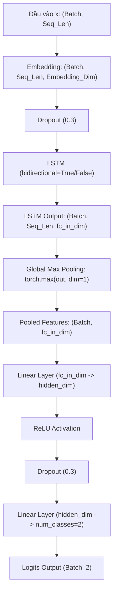

# ĐỀ CƯƠNG ÔN TẬP CHUYÊN SÂU: LSTM 1D & BiLSTM
*Tài liệu ôn thi tập trung toàn bộ kỹ thuật lý thuyết và thực hành liên quan đến LSTM 1 chiều (LSTM 1D) và LSTM 2 chiều (BiLSTM) từ mã nguồn dự án.*

---

## 1. MỤC TIÊU DỰ ÁN & ĐẶC THÙ TIẾNG VIỆT
Dự án nhằm phân loại tin tức Tiếng Việt thành **Tin Thật (Real News - Label 0)** hoặc **Tin Giả (Fake News - Label 1)**.
* **Đặc thù ngôn ngữ**: Tiếng Việt là ngôn ngữ đa âm tiết, ý nghĩa nằm ở các từ phức/từ ghép (như `thành phố`, `tin giả`). 
* **Giải pháp tách từ**: Sử dụng thư viện `pyvi` (`ViTokenizer.tokenize`) để nối các âm tiết của từ ghép bằng dấu gạch dưới (ví dụ: `thảo mộc` $\rightarrow$ `thảo_mộc`). Điều này giúp mô hình coi từ ghép là một token duy nhất trong từ điển và học đúng ngữ nghĩa.

---

## 2. CÁC TỆP MÃ NGUỒN QUAN TRỌNG LIÊN QUAN ĐẾN LSTM
Để ôn tập, bạn cần tập trung vào các tệp nguồn sau:
* **[lstm_model.py](file:///d:/Fake-news-detection/src/lstm_model.py)**: Định nghĩa lớp mô hình `BiLSTMClassifier`.
* **[data_loader.py](file:///d:/Fake-news-detection/src/data_loader.py)**: Tiền xử lý, xây dựng bộ từ điển (`Vocab`), mã hóa và chuẩn bị Dataloader cho LSTM.
* **[train.py](file:///d:/Fake-news-detection/src/train.py)**: Nạp ma trận nhúng tiền huấn luyện (PhoW2V/FastText), vòng lặp huấn luyện (`train_epoch`), cấu hình Loss, Optimizer, LR Scheduler và Early Stopping.
* **[main.py](file:///d:/Fake-news-detection/app/main.py)**: Nạp mô hình suy luận thực tế và chứa thuật toán giải thích tầm quan trọng của từ khóa (**Occlusion** kết hợp **NMS**).

---

## 3. KIẾN TRÚC MÔ HÌNH (MODEL ARCHITECTURE)

Sơ đồ luồng dữ liệu của mô hình `BiLSTMClassifier`:
$$\text{Input (Batch, Seq\_Len)} \rightarrow \text{Embedding Layer} \rightarrow \text{LSTM / BiLSTM} \rightarrow \text{Global Max Pooling 1D} \rightarrow \text{FC Classification Head} \rightarrow \text{Logits Output}$$



### 3.1. So sánh LSTM 1D và BiLSTM

| Tiêu chí | LSTM 1 Chiều (LSTM 1D) | LSTM 2 Chiều (BiLSTM) |
| :--- | :--- | :--- |
| **Hướng truyền tin** | Xuôi theo chiều thời gian từ trái sang phải ($t_1 \rightarrow t_T$). | Song song 2 hướng: Xuôi từ trái sang phải ($\overrightarrow{h_t}$) và Ngược từ phải sang trái ($\overleftarrow{h_t}$). |
| **Ngữ cảnh của từ tại bước $t$** | Chỉ phụ thuộc vào các từ đứng trước nó ($x_1, \dots, x_{t-1}$). | Phụ thuộc vào cả các từ đứng trước ($x_1, \dots, x_{t-1}$) và các từ đứng sau ($x_{t+1}, \dots, x_T$). |
| **Vectơ ẩn đầu ra ($h_t$)** | $h_t = \overrightarrow{h_t}$ | Ghép nối: $h_t = [\overrightarrow{h_t} \mathbin{\Vert} \overleftarrow{h_t}]$ (Ghép dọc theo trục đặc trưng). |
| **Kích thước vectơ ẩn** | `hidden_dim` (ví dụ: 128) | `hidden_dim * 2` (ví dụ: 256) |
| **Hiệu năng xử lý văn bản** | Hạn chế hơn vì ngôn ngữ tự nhiên có sự phụ thuộc ngữ cảnh đa chiều. | Vượt trội hơn, nắm bắt ngữ nghĩa toàn diện và hai chiều. |

### 3.2. Giải thích chi tiết mã nguồn kiến trúc (`lstm_model.py`)
* **Embedding Layer**:
  ```python
  self.embedding = nn.Embedding(vocab_size, embedding_dim, padding_idx=0)
  ```
  `padding_idx=0` đảm bảo token `<pad>` luôn được ánh xạ sang vectơ bằng 0 và không cập nhật gradient, tránh làm nhiễu mô hình.
* **LSTM Layer**:
  ```python
  self.lstm = nn.LSTM(
      input_size=embedding_dim,
      hidden_size=hidden_dim,
      num_layers=num_layers,
      bidirectional=bidirectional, # Điều khiển 1 chiều hay 2 chiều
      batch_first=True,            # Tensor đầu vào dạng (Batch, Seq_Len, Features)
      dropout=dropout if num_layers > 1 else 0.0
  )
  ```
* **Global Max Pooling 1D**:
  ```python
  out, (hn, cn) = self.lstm(embedded)
  pooled, _ = torch.max(out, dim=1)
  ```
  *Lý do không dùng trạng thái ẩn cuối cùng $h_n$*: Trong câu dài, $h_n$ dễ bị mất mát thông tin của các từ đầu chuỗi (suy giảm ngữ cảnh). Max Pooling quét qua toàn bộ chiều dài câu (`dim=1` tức `seq_len`) để giữ lại các đặc trưng mạnh nhất kích hoạt từ các từ khóa quan trọng ở bất kỳ vị trí nào trong văn bản.
* **Classification Head**:
  ```python
  fc_in_dim = hidden_dim * 2 if bidirectional else hidden_dim
  self.fc = nn.Sequential(
      nn.Linear(fc_in_dim, hidden_dim),
      nn.ReLU(),
      self.dropout,
      nn.Linear(hidden_dim, num_classes)
  )
  ```

---

## 4. TIỀN XỬ LÝ & DATALOADER CHO LSTM (`data_loader.py`)
Mạng LSTM yêu cầu chuyển văn bản thành chỉ số số nguyên tương ứng:
* **Bộ từ điển (`Vocab`)**: Thống kê tần suất từ trên tập huấn luyện. Chỉ giữ các từ xuất hiện $\ge 2$ lần để loại bỏ nhiễu. Lưu token `<pad>` (index 0) và `<unk>` (index 1).
* **Mã hóa câu (`encode`)**: Chuyển câu thành chuỗi index. Cắt ngắn hoặc thêm `<pad>` về chiều dài cố định `max_len=128`.
* **Cân bằng lớp (Oversampling)**: Lặp mẫu ngẫu nhiên các tin thuộc lớp Tin Giả (Label 1) cho đến khi cân bằng số lượng với lớp Tin Thật để tránh thiên vị lớp.

---

## 5. QUY TRÌNH & KỸ THUẬT HUẤN LUYỆN (`train.py`)

### 5.1. Nhúng từ tiền huấn luyện (Pre-trained Word Embeddings)
Thay vì học ngẫu nhiên, mô hình có thể nạp sẵn vectơ biểu diễn từ PhoW2V (100 chiều) hoặc FastText (300 chiều):
```python
# Tạo ma trận ngẫu nhiên
weight_matrix = np.random.normal(scale=0.6, size=(vocab_size, embedding_dim))
# Gán vector bằng 0 cho token <pad>
weight_matrix[0] = np.zeros(embedding_dim)

# Ánh xạ từ vựng
for word, idx in vocab_w2i.items():
    if idx == 0: continue
    vec = pretrained_dict.get(word, None)
    if vec is None:
        vec = pretrained_dict.get(word.replace(" ", "_"), None)
    if vec is not None:
        weight_matrix[idx] = np.array(vec)
```
Sau đó nạp đè vào lớp nhúng của mô hình: `model.embedding.weight.data.copy_(weights)`.

### 5.2. Các kỹ thuật Regularization chống Overfitting
Để hạn chế overfitting của mô hình tuần tự LSTM trên tập dữ liệu nhỏ:
1. **L2 Regularization (Weight Decay)**: Thêm thành phần phạt trọng số vào Optimizer Adam (`weight_decay=1e-4`).
2. **Dropout (Tỷ lệ 0.3)**: Triển khai sau lớp Embedding và trong MLP Classification Head.
3. **Bộ điều khiển tốc độ học (`ReduceLROnPlateau`)**: Giảm nửa tốc độ học (`factor=0.5`) nếu F1-score trên tập xác thực không cải thiện sau 2 Epoch liên tiếp.
4. **Dừng sớm (`Early Stopping`)**: Dừng huấn luyện sớm nếu F1-score xác thực không cải thiện sau 5 Epoch liên tiếp để chống học tủ.

### 5.3. Vòng lặp huấn luyện chính
* **Pha Train**: Đặt mô hình ở chế độ huấn luyện (`model.train()`), duyệt từng Batch, xóa gradient (`optimizer.zero_grad()`), tính logits (`outputs = model(inputs)`), tính loss, lan truyền ngược (`loss.backward()`) và cập nhật trọng số (`optimizer.step()`).
* **Pha Validation**: Đặt mô hình ở chế độ đánh giá (`model.eval()`), khóa gradient (`with torch.no_grad():`), dự đoán trên tập Validation để đo chỉ số Loss và F1-score.
* **Lưu Checkpoint tốt nhất**: Nếu F1 xác thực đạt kỷ lục mới, lưu trọng số cùng bộ từ điển (`vocab_word2idx`) vào tệp `models/best_lstm.pt` (hoặc `best_lstm_1d.pt`).

---

## 6. THUẬT TOÁN GIẢI THÍCH TỪ KHÓA (EXPLAINABILITY) DÀNH CHO LSTM (`main.py`)
Để biết từ ghép nào đóng vai trò lớn nhất quyết định dự đoán của mô hình, dự án áp dụng phương pháp **Occlusion (Che khuất)** trong [main.py](file:///d:/Fake-news-detection/app/main.py):

1. **POS Tagging**: Chỉ giữ lại các từ thuộc thực từ (Danh từ, Động từ, Tính từ, Danh từ riêng, Từ mượn) để loại bỏ hư từ vô nghĩa.
2. **Mặt nạ bảo toàn vị trí (Position-Preserving Padding)**:
   * Lần lượt che từng ứng viên bằng cách thay thế nó bằng token `<pad>` (index 0).
   * **Lưu ý thi cử**: *Không được xóa từ ra khỏi câu* làm ngắn chuỗi vì sẽ dịch chuyển chỉ số vị trí các từ đứng sau, làm xáo trộn ngữ cảnh truyền đi của LSTM. Thay bằng `<pad>` giúp giữ nguyên cấu trúc vị trí tuyệt đối.
3. **Tính điểm ảnh hưởng**:
   Tính hiệu số xác suất lớp dự đoán đúng trước và sau khi che:
   $$\text{Score}(i) = P_{\text{gốc}} - P_{\text{sau\_khi\_che\_từ\_i}}$$
   Điểm $\text{Score} > 0$ chứng tỏ từ đó đóng vai trò quan trọng trong dự đoán của mô hình.
4. **Loại bỏ chồng chéo bằng NMS (Non-Maximum Suppression)**:
   Sắp xếp từ khóa theo điểm số từ cao xuống thấp và loại bỏ các từ đơn/từ ghép gối nhau cùng xuất hiện (ví dụ: ưu tiên cụm `giả_mạo` và loại bỏ `giả` hoặc `mạo` riêng lẻ).
